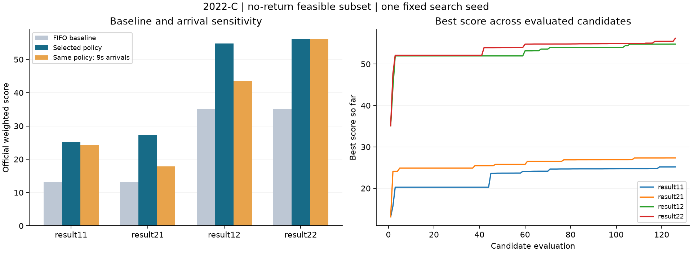

# 2022 年研赛 C 题调序调度参考解答

本解答采用逐车车道分配与离散事件模拟，完成两个问题、两个附件的四组调度计算，并输出题目要求的逐秒区域矩阵。它是读取历史 A/B 解答及优秀论文部分章节后的学习改进版本，不是独立盲测。当前搜索限定为不使用返回道的可行子集，因此给出的是有检查证据的启发式可行解，未证明全局最优，也不是已通过正式竞赛论文 S0–S8 的成稿。

## 摘要

涂装与总装的生产偏好不同，需要利用六条 FIFO 进车道重新排列车身序列。本文将调度分为车道分配、强制纵向移动和横移机选择三部分，使用离散事件模拟保证动作时间与资源约束，再用固定随机种子的多起点搜索和逐车车道局部变异寻找较高得分方案。针对题面未给出外部到达时刻的情况，主计算采用按给定顺序持续可取车的假设，另对每 9 秒到达一辆的情景进行敏感性分析。四组主计算总分为 25.158、54.818、27.331、56.225，分别比相应直通基线增加 12.058、19.718、14.231、21.125 分。独立检查从横移机动作重新构造车道移动时间，并逐格验证最终矩阵。研究同时保留了题面时间评分与“理论最快时间”之间的矛盾，避免通过额外截断悄然改变评分函数。

## 一 题目与数据

两个附件均包含 318 辆车，字段为进车顺序、车型、动力、驱动。附件 1 含 212 辆混动两驱、77 辆燃油两驱、29 辆燃油四驱；附件 2 分别为 159、130、29 辆。车型 A/B 未进入题面四项评分，也没有额外的车型切换约束，因而保留在输入记录中而不人为增加目标。

问题一保留全部优先规则：返回道末端车身优先接入；多个进车道首位车身同时可调度时，先处理最早到达首位的车身。问题二只取消这两条优先规则，送车机有车可处理时不能主动空闲等其余约束仍然保留。

## 二 建模假设及边界

1. 给定序列中尚未进入 PBS 的车辆位于外部等待队列。接车机按顺序取车，下一辆在前一辆被取走时成为出车口的队首。题面未提供到达时刻，主模型不添加固定外部节拍；另计算 9 秒节拍情景。
2. 纵向移动持续 9 秒。启动移动时释放起点、预留终点；后车只能向未被占用或预留的下一车位移动。车道容量按停放和移动中的车辆合计，不超过 10。
3. 整数时刻恰好经过停车位时，记录该时刻最后到达的有编码区域；移动区间内部的整数采样点为空白。例如第一辆在 0 秒进入第 4 道第 10 位，矩阵写 410，1–8 秒为空白，9 秒写 49。为避免两辆在同一整数时刻被编码为同一入口车位，接车策略不在某道第 10 位刚离开的该秒再次接入该道；这是可行调度策略的保守选择，不冒充题面的新增硬约束。
4. 车身送达总装口的该秒记 3，后续离开建模区域而留空。横移机零时长动作可能使同一秒先后送出两辆车，因此区域 3 可以在两行出现；题目没有规定总装口容量为 1。停车位及两台横移机的容量为 1，必须严格核查。
5. 本轮选择不使用返回道，令返回次数 R=0。这减少求解和复核复杂度，并保留返回得分 100，但缩小搜索范围；不能据此推断返回道普遍无用。

## 三 目标函数与一个必要上界

设出车排列为 π，混动车在排列中的位置为 h₁,…,h_H。混动间隔不合格次数为

`P1 = Σ(k=1,…,H−1) I(h[k+1] − h[k] ≠ 3)`。

从排列首辆车的驱动类型出发，在“另一类型重新变回首类型”的位置分块。若块 b 中两驱与四驱的数量不同，则扣 1 分，记不合格块数为 P2。官方示例 `442242444224` 分成 `4422 / 42 / 44422 / 4`，因此 P2=2。

设最终完成时间为 T，车数为 C，返回次数为 R。严格使用题面公式：

`S1=100−P1；S2=100−P2；S3=100−R；S4=100−0.01[T−(9C+72)]`。

于是总分为

`S = 100 − 0.4P1 − 0.3P2 − 0.2R − 0.001[T−(9C+72)]`。

目标是最大化 S。S1 可以为负；不将它强行截成 0。若 T 小于 9C+72，字面公式使 S4 大于 100，主结果保留该值，另报告仅截断 S4 的敏感性结果。

在选择算法之前，应先看数据允许达到什么水平。设混动车数量为 H、燃油车数量为 F，每个合格混动间隔独占两辆燃油车，最多能满足 `min(H−1, floor(F/2))` 个间隔。因此

`P1 ≥ max(0, H−1−floor(F/2))`。

附件 1 得到 P1≥158，即 S1≤−58；附件 2 得到 P1≥79，即 S1≤21。该界忽略了车道与时序限制，不能保证可达到，但说明总分较低有车型结构原因，不能拿 100 分作为这些数据下切实可达的目标。该推导借鉴论文 C22103190082 的数量分析思路，并以本轮读取的附件计数重新计算。

## 四 离散事件模型

设车道 l 的单程横移时间为 d_l，六道取值为 `9,6,3,0,6,9` 秒。接车动作在时刻 t 开始，t+d_l 卸入第 10 位，t+2d_l 回到中央；送车动作在 t 开始，t+d_l 从第 1 位取车，t+2d_l 送达总装并回到中央。动作区间不可重叠或打断。

对同一车道中的第 j 辆车，令 a[j,p] 为到达车位 p 的时间，u[j,p] 为离开车位 p 的时间。已知接车卸载时间 a[j,10] 和最终送车取车时间 u[j,1]，纵向移动满足

`u[j,p] = max(a[j,p], u[j−1,p−1])，p=10,…,2`，

`a[j,p−1] = u[j,p]+9`。

第一辆前方没有车辆，前驱释放时间按 0 处理。该递推表达“自身已经到达，且前车已释放下一位置时立即移动”，同时防止后车追越。完整模拟另维护目的车位预留和在道总车数，防止在移动期间被错误再调度。

在送车机空闲的时刻，候选集是已经到达各道第 1 位的车身。问题一只在最早到达者中选择；问题二可从全部候选中选择。两问都立即开始一个送车动作。选择启发式倾向于减少混动间隔和驱动分块的新增罚分，并以横移时间处理近似平局。所有最终得分由完整输出序列重新计算，不以局部启发式成本代替正式目标。

## 五 候选路线与求解

最小基线是所有车都走第 4 道，保留原序列、R=0。第一辆用 81 秒通过 9 段纵向移动，后续间隔 9 秒，因此 `T0=81+9(C−1)=9C+72=2934` 秒。两个附件基线分数为 13.100 和 35.100。

主方案先比较直通、历史 B 偏好、燃油优先中央车道、驱动分区和 40 组随机属性车道偏好。再加入历史 A 保留的逐车车道分配作为热启动，以新模拟器重新计算；这不是恢复 A 缺失的原始优化过程。将较好调度固定为 318 维车道向量，执行 80 次局部变异，每次修改 1、2 或 4 辆车的车道，仅接受正式总分更高的邻域解。种子由附件和问题编号固定，每个候选的参数与得分均保留。

未选为主方案的路线是全时间展开整数规划和带返回道的大规模遗传/退火搜索。前者需要大量时间、位置、资源变量，本轮没有求解器最优性证据；后者可能改善出车顺序，但每次返回直接扣 0.2 分并占用横移机，还需单独验证返回通道。有限预算下先交付可复核的可行解。若后续返回策略在同一输入、同一状态语义和相同计算预算下稳定提高总分，再扩展搜索范围。

## 六 计算结果

- 问题一附件 1：P1=172，P2=19，R=0，T=3276 秒；S1=−72，S2=81，S3=100，S4=96.58，总分 **25.158**。
- 问题一附件 2：P1=95，P2=24，R=0，T=2916 秒；S1=5，S2=76，S3=100，S4=100.18，总分 **54.818**。
- 问题二附件 1：P1=169，P2=18，R=0，T=2603 秒；S1=−69，S2=82，S3=100，S4=103.31，总分 **27.331**。
- 问题二附件 2：P1=91，P2=21，R=0，T=4009 秒；S1=9，S2=79，S3=100，S4=89.25，总分 **56.225**。

问题二附件 2 虽然比问题一耗时更久，但 P1 和 P2 减少带来的加权收益超过时间损失，故总分更高。这说明不能单独按完工时间评判调序方案。另一方面，它仍低于历史 A 所报告的 56.731，不能宣称本次四组分数全部超过既有解答；历史方案的状态和输出约定也不同，不能用这四组数值证明 Core 能力提升。

结果表分别为 `result11.xlsx`、`result12.xlsx`、`result21.xlsx`、`result22.xlsx`。每张只有一个矩阵工作表，第一行从 0 到 T，第一列为车号；与附件 4 一致包含 T+1 个采样时刻。全部区域值为静态数值，真正空白单元格表示区间移动或在建模区域之外，没有 LET、XLOOKUP 或其他公式依赖。

图中 resultXY 表示问题 X、附件 Y。左图按附件分组；右图记录已评估候选中的最好得分，不代表全局收敛证明。

## 七 验证与敏感性

独立检查程序不导入求解器，通过接车卸载时间和送车取车时间重新推算所有纵向移动，并检查输入次序、车道 FIFO、容量、横移机时间和不重叠、问题一最早到达优先、送车机非空闲、输出排列、正式得分和每一个矩阵单元格。四组均通过该声明范围的检查。返回通道不被本方案使用，因此不把这次通过扩张成返回模型也已验证。

回归包括 1、2、10、30、318 辆直通样例，官方驱动分块示例，以及故意改错总分、移动时长和停车位矩阵的三个负例。负例均被独立检查发现。

固定已选策略，改成每 9 秒到达一辆时，四组得分分别为 24.317、43.472、17.876、56.225。这个对照没有重新优化策略，只回答“同一策略对到达假设有多敏感”。问题一附件 2 和问题二附件 1 下降明显，说明外部节拍属于需要明确的业务条件，不能默默补入题意。

对 S4 使用 `min(S4,100)` 的额外敏感性处理时，四组总分变为 25.158、54.800、27.000、56.225。它仅用于说明题面歧义的影响，不替换字面公式的主结果。

## 八 从优秀论文中学习的内容

本轮针对两篇论文的相关章节进行局部学习，未声称完成 49 页和 39 页全文审阅或作者代码复现。页码均为 PDF 物理页码。

论文 C22103190082 第 15–20 页的可取之处是：先用车型数量分析得分上界，再设置直通基线，比较若干启发式初值，最后使用局部改变提升结果。本解答采用了数量界、基线比较、属性分区和逐车车道变异；没有照搬其混沌遗传算法名称，也没有宣称复现其作者分数。第 6 页明确假设移动期间保留原区域代码，这与本轮依据题面空白规则采用的输出约定不同，不能因它来自优秀论文便直接照用。

论文 C22103360057 第 13、16、22、25 页提供了有用的组织方法：将接车与送车决策拆开，按四项目标列结果，说明局部搜索改善哪一项并牺牲哪一项，同时列出适用范围。本解答采用了这套论证结构，并以候选路线比较和敏感性结果填充。两份附件均有结果，不足以推出对任意输入均有效；其摘要、表格和正文对返回次数的叙述还需要逐项统一。表格算术可核验，不等于作者算法和约束已完整复现。

## 九 局限与后续改进

本轮结果依赖明确的整数采样端点约定和外部等待队列假设；没有处理未知到达节拍、设备故障或车身长度引起的连续空间碰撞。搜索不使用返回道、只有一个固定种子且在同一附件上选参数，不是跨题泛化实验。阅读过同题历史解答和论文，因此成绩提升不能归因为“独立学会了新题”。

下一步优先比较受控返回策略与当前可行子集，并补充多个种子、独立到达情景和解质量界。得到可迁移规则后，再在另一题上检验。用户日后有自己的答案时，可按题意、数量分析、模型选择、代码、验证、图表论证逐问对照，而不是只比较最终分数。

## 复现入口

代码位于 `code/`，原始字段快照位于 `inputs.json`。使用具有读取依赖的 Python，依次运行 `code/solve.py --budget 40 --local 80`、`code/validate.py`、`code/test_regressions.py`。XLSX 导出脚本为 `code/export_xlsx.mjs`，需要 `@oai/artifact-tool`；四个已生成的结果表可以直接打开，不需要重新安装导出工具。

证据包括完整搜索记录、每车运动记录、横移机动作、独立检查、故意破坏测试、工作簿逐格回读和源文件哈希。所有结论以其对应证据范围为限。

快速重放已选策略：`python code/replay_selected.py`。工作簿回读：`python code/verify_xlsx.py`（需 openpyxl）。绘图：`python code/plot_results.py`（需 matplotlib）。求解与独立验证仅需 Python 标准库。历史 A 热启动动作已随包放在 `warmstarts/`，不依赖本机历史目录。
