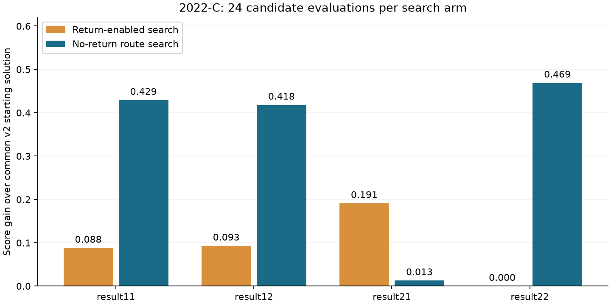

# 2022 年研赛 C 题：涂装—总装缓存区调序调度参考解答

案例修订 v3，2026-09-21。本文完成两问、两个附件的四组计算，包含返回道、逐秒矩阵和独立复算。这是阅读同题历史解答及优秀论文相关章节后的参考解答，不是盲测或已通过正式 S0–S8 的比赛稿。MathModel-Core 正式基线仍为 v1.41。

## 摘要

将调序分为逐车车道分配、强制纵向移动和横移机调度，采用释放起点、预留终点的离散事件模型，以访问编号表示返回后再次进道。以此前多种子搜索的方案作为共同起点，在每组各 24 次候选评估预算下，比较受控返回策略与不返回的车道局部搜索。四组最终得分为 26.070、55.990、28.334、57.703，仅问题二附件 1 采用一次返回。通过独立重建 FIFO 运动、优先规则、容量与完整逐秒轨迹核验可行性，并以外部到达节拍敏感性说明适用范围。

## 一、题意与输入

两个附件各有 318 辆车，字段为进车顺序、车型、动力和驱动。附件 1 含 212 辆混动两驱、77 辆燃油两驱、29 辆燃油四驱；附件 2 分别为 159、130、29 辆。车型 A/B 不直接进入题面评分，不人为增加切换目标。

问题一保留返回道末端优先接车、进车道首位最早到达优先送车两项规则；问题二只取消这两项优先规则。两问都保留 FIFO、设备容量以及送车机有车可处理时不能主动闲置等约束。

## 二、建模假设

1. 题面没有提供外部到达时刻。主计算把给定顺序作为持续可取的外部等待队列，前一辆被接走后下一辆成为队首；另检验每 9 秒到达一辆，不把这个节拍默默加进题意。
2. 相邻纵向车位移动耗时 9 秒，启动时释放起点并预留终点，移动中不能再次调度。每道容量按停车和移动中的车辆合计，不能超过 10。
3. 整数时刻恰好在停车位时记录区域，移动区间内部为空白。例如第 4 道从 10 位在 t=0 出发，0 秒写 410，1–8 秒为空白，9 秒写 49。策略不在某道 10 位刚离开的同秒再次接入，以避免同一入口区域重复；这是保守调度选择，不是新增题面硬约束。
4. 横移机动作不可被中断，结束回中心。送达总装的该秒记 3，后续离开区域留空。零时长动作可能同秒先后送达两辆车；不把总装代码 3 误当容量为一的停车位。
5. 主搜索每车最多返回一次，回归另覆盖每车两次返回。搜索范围有限，不据此推断多次返回无用。

## 三、目标函数与数量界

P1 为相邻混动车输出位置差不等于 3 的次数。驱动序列在“由另一类型回到起始驱动类型”处切块，P2 为四驱、两驱数量不等的块数，末块也计分。R 为返回次数，T 为完工时间，C 为车辆数：

`S1=100−P1；S2=100−P2；S3=100−R；S4=100−0.01[T−(9C+72)]`。

`S=0.4S1+0.3S2+0.2S3+0.1S4=100−0.4P1−0.3P2−0.2R−0.001[T−(9C+72)]`。

主结果按字面公式计算，允许 S1 为负或 S4 超过 100；另列封顶敏感性，不悄然修改主目标。官方驱动示例 442242444224 分为 4422、42、44422、4，两块不合格。

若共有 H 辆混动、F 辆燃油，H−1 个相邻混动间隔中，每个合格间隔独占两辆燃油，故合格间隔至多 floor(F/2)，得到 `P1≥max(0,H−1−floor(F/2))`。两附件 P1 至少为 158、79，S1 至多为 −58、21。该界忽略设备约束，不等于可达最优分数。

## 四、含返回道的模型与独立递推

横向坐标取六道为 0、3、6、9、15、18，中心为 9，返回道为 12。直接进出车往返耗时 `2|y_l−9|`，依次为 18、12、6、0、12、18 秒。道 l 到返回道的动作耗时 `|y_l−9|+|y_l−12|+3`；返回道接车到道 l 总耗时相同，但取车发生在动作开始后 3 秒。

每辆车每次进道有独立访问编号。对同一道内第 j 次访问，记到达位置 p 的时刻为 a[j,p]、离开为 u[j,p]。进车道入口为 10、出口为 1：

`a[j,10]=接车卸载时刻`；

`u[j,p]=max(a[j,p],u[j−1,p−1])`，`a[j,p−1]=u[j,p]+9`，p 从 10 到 2；

`u[j,1]=送车取车时刻`。

返回道入口为 1、出口为 10：

`a[j,1]=送车卸载时刻`；

`u[j,p]=max(a[j,p],u[j−1,p+1])`，`a[j,p+1]=u[j,p]+9`，p 从 1 到 9；

`u[j,10]=返回接车取车时刻`。

没有前车时其释放时间按零处理。递推表达“已到位且下一位释放时立即移动”。返回后的车是新的进道访问，不能以车号唯一索引覆盖第一次轨迹。模拟器维护起点释放、目的位预留；独立检查器仅依据横移机动作和访问次序重建运动，不调用求解器。

问题一从已到首位的车中取最早到达者；问题二按混动间隔、驱动分块的增量罚分与横移耗时选车。返回策略只决定该车去总装还是返回道，不能绕过问题一首位优先规则。接车按相应问题的返回末端优先规则执行。

## 五、候选路线与求解

直通基线为全部走第 4 道，T=81+9(C−1)=2934 秒，两附件得分 13.100、35.100。此前已比较属性分区、多起点偏好及逐车变异，并从五颗种子的续搜得到 v2 起点。

本轮两路线各评估 24 个新候选。不返回路线对逐车车道向量做 1、2 或 4 位变异，接受提高总分的邻域。允许返回路线固定 v2 首次分配，比较 12 个单车返回探测及 12 个反应式策略组合：总返回预算为 1/3/8，触发燃油间隔为仅 1 或 0/1，返回后按原分配或优先中央道接入。每车最多返回一次，最终可以退回起点。

两路线候选次数相同，但每次耗时和搜索空间不同，所以是有限范围的对照，不是一般算法优越性证明。全时间展开整数规划可用于求界，但本轮没有求解；大规模联合优化首次分配、再分配、多次返回也尚未实施。

## 六、实际结果与选择理由

- 问题一附件 1：P1=170，P2=19，R=0，T=3164；S1=−70，S2=81，S3=100，S4=97.70，总分 **26.070**。
- 问题一附件 2：P1=93，P2=23，R=0，T=2844；S1=7，S2=77，S3=100，S4=100.90，总分 **55.990**。
- 问题二附件 1：P1=166，P2=18，R=1，T=2600；S1=−66，S2=82，S3=99，S4=103.34，总分 **28.334**。
- 问题二附件 2：P1=88，P2=21，R=0，T=3731；S1=12，S2=79，S3=100，S4=92.03，总分 **57.703**。

resultXY 表示问题 X、附件 Y。允许返回路线最好得分分别为 25.729、55.665、28.334、57.234，不返回路线为 26.070、55.990、28.156、57.703。因此只在第三组采用返回。第四组允许返回路线的最好值实际来自不返回的起点回退，不能写成使用返回道的成功方案。

第三组实际返回 15 号车：93 秒进入第 5 道，182 秒从道首被取走，185 秒进入返回道，329 秒从返回末端被取走，332 秒再次进入第 5 道，440 秒到总装。相对 v2，P1 少一次得 0.4 分，返回一次扣 0.2 分，总时间增加 9 秒扣 0.009 分，净增 `0.4−0.2−0.009=0.191`。这解释了为什么这次返回值得采用。

四组均超过自身 v2 起点，但跨版本增加了计算量；历史 A/B 的状态和输出约定也不同，不能推断同预算胜出或跨题能力提高。

## 七、检查与敏感性

独立检查按每次访问配对接车、送车、返回和再接车，核对首次进车顺序、车流连续性、双向 FIFO 递推、横移几何时间与不重叠、容量、问题一两项优先规则、送车非空闲、排列、返回计数、正式得分和每个矩阵单元格。两路线最终保留方案及交付方案通过检查；新成为最优的候选必须先通过独立检查。其他候选执行了模拟器不变量检查，不宣称全部独立验证。

17 项回归覆盖 1/2/20 辆车重复返回、四组旧无返回方案兼容、故意破坏返回运动/矩阵/次数/流程，以及把问题二调度错当问题一时应拒绝的负例。两组 40 辆多车道压力样例实际返回 72、69 次并通过复算。这些证据不等于任意输入、任意策略都已验证。

固定当前策略，改为每 9 秒到达一辆，四组分数为 22.592、41.402、18.876、57.703；没有为该情景重新优化。主情景提升有时伴随另一情景退步，随机种子稳定性不等于业务条件稳健性。

若 S4 额外封顶 100，四组分数为 26.070、55.900、28.000、57.703，仅作为评分公式敏感性。四份 Excel 含 t=0 至 T 的真实空白与静态整数，不依赖动态公式。

## 八、从优秀论文中学习的内容

此前局部阅读 C22103190082（PDF 第 15–20 页），采用数量界、直通基线和多个候选起点的论证组织，没有声称复现其混沌遗传算法；第 6 页移动中保留源区域的假设未采用。C22103360057 第 13、16、22、25 页启发了接车/送车拆分、四项评分展开和局限说明，没有照搬未经适用性检验的阈值。本轮没有新增全文阅读或作者代码复现记录。

本轮落实的候选经验是：复杂模型与同候选预算的简单模型竞争；循环流程使用“实体＋访问编号”；把具体决策的收益、直接成本和时间成本算清楚；保留未选方案及不利情景。以上只在本题验证，尚待跨题检验。

## 九、结论与下一阶段

在明确的外部队列和端点语义下，本解答给出四组可复算可行方案。返回道有局部收益，也有直接罚分和设备占用，应逐组竞争选择。目前没有全局最优性证明，也没有穷尽联合分配和多次返回。

这一案例的修复与对照已有实质结果。下一阶段应换题检验建模、实现、验证和论文论证能否迁移，避免用同题微小涨分代替能力验证。本题后续若继续，应围绕解质量界或多到达情景稳健性等明确新目标。

## 复现

运行 `python code/replay_returns.py` 重放四组已选结果，`python code/test_returns.py` 运行回归，`python code/compare_returns.py` 重跑本轮对照。核心代码仅需 Python 标准库，inputs.json 保存计算字段，seed_inputs/ 保存固定 v2 起点。

`code/verify_xlsx.py` 用 openpyxl 逐格回读，`code/export_xlsx.mjs` 用 @oai/artifact-tool 导出，`code/plot_results.py` 用 matplotlib 绘图。重新计算会覆盖结果，随后须重新导出并检查 Excel。完整入口见 README.md。
