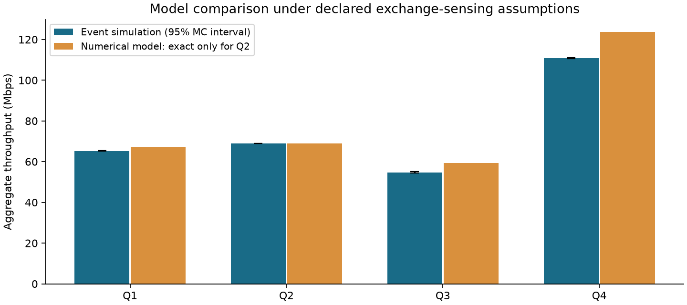
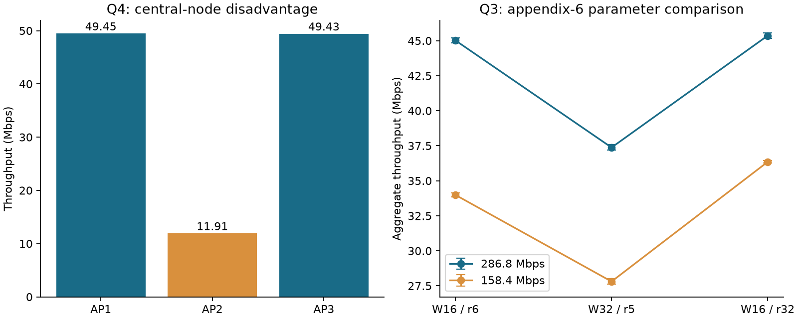

> 当前完整案例修订revision_v7：保留v6正文及历史标识，合并第五篇学习验证。正式Core仍为v1.41。

> 当前案例修订：revision_v6。保留v5完整正文及其历史修订标识，新增第四篇收益/计时验证；正式Core仍为v1.41。

> 当前本地完整解答为案例修订v5。前文各版阅读状态为历史时点，最新补充见文末；第三篇全文文本评审已完成。

> 以下保留案例修订 v4 的历史内容。原解答与前两篇改进保留，第三篇 Q3 辅助解析及适用限制见文末。

> 以下部分保存案例修订 v3 的内容。包含原解答、第一篇的诊断补充和文末第二篇的条件化分析。历史冻结时点的“未读同题论文”只适用于当时。

> 案例修订 v2：前文保留学习前冻结解答，其中“未读同题解答”等表述仅指冻结时点。该修订时点已读第一篇同题论文；新增学习与验证见文末。图片链接已调整到原文件位置。

# 2023 年研赛 A 题：WLAN 网络信道接入机制建模

跨题迁移参考解答 v1 · 2026-09-22

本稿在未打开 2023-A 同题优秀论文的情况下完成。Core 已有其他年份 WLAN 题的领域经验，不能称为领域盲测；基础模型预训练暴露也无法排除。本稿是可复算的条件性参考解答，尚未经过同题优秀论文对照及正式比赛流水线认证。

## 摘要

针对互听、隐藏节点及三 BSS 链式拓扑，区分载波监听关系与数据干扰关系。问题一建立有限重传的退避固定点；问题二进一步建立 16 状态的残余计数差更新链，获得精确数值解。问题三、四保留实际发包区间、局部忙闲状态和冻结计数器，以离散事件仿真估计吞吐，并与较简单的闭合模型比较。每个主场景运行五个独立随机种子，同时报告正文基础参数与附录六组参数。验证包括单链路更新公式、精确链、逐包独立事件重建及故意篡改负例。结果显示，全网吞吐会掩盖中间 AP 的发送机会劣势；监听忙碌时间约定是重要的模型不确定性，不能只以蒙特卡洛误差描述精度。

## 一、题意、参数与约定

四问均研究 AP 到各自 STA 的下行。Q1 两 AP 互听，重叠发送均失败；Q2 两 AP 互听，但同时发包均成功；Q3 两 AP 不互听，数据区间重叠均失败，非重叠另有 10% 信道丢包；Q4 的 AP1–AP2、AP2–AP3 互听，AP1 与 AP3 不互听，后两者重叠仍可成功。

使用载荷 1500 Bytes、MAC 头 30 Bytes、PHY 头 13.6 微秒；DIFS=43、SIFS=16、ACK=32、ACKTimeout=65、SLOT=9 微秒。基础 CWmin=16、CWmax=1024、最大重传 r=32；r 次重传加首次发送，共最多 r+1 次尝试。Q1 基础速率 455.8 Mbps，Q2 为 275.3 Mbps。

Q3/Q4 正文写 455.8 Mbps，附录6另列 286.8/158.4 Mbps，每个速率下有 (CWmin,r)=(16,6)、(32,5)、(16,32)。本稿同时报告正文基础场景和六组附录场景，不把速率覆盖关系藏在代码里。

必要假设：各 AP 队列始终有包，报告饱和吞吐；ACK 在数据成功后可靠，忽略传播时间、噪声以外的捕获及未给出的 STA 间干扰。Q4 邻接 AP 同时起发时按低 SIR、双方失败处理，另检验并发均成功的替代情景；Q4 未声明 Pe=10%，主情景取 Pe=0，不沿用 Q3 的丢包参数。

主计算按题面 Ts/Tc 的虚拟时隙约定，把数据到 ACK/ACKTimeout 结束视作一个可被互听节点感知的交换忙期，其后再等待 DIFS。此为明确的介质保留/虚拟忙期近似，不声称 ACKTimeout 全程都在发射无线电。对于仅凭 AP RSSI 无法确定的 ACK/NAV 细节，另用“仅数据帧形成可监听忙期”作敏感性情景；该替代也不是完整物理层真值。

## 二、三条建模路线与选择

无干扰更新基线给出每节点平均周期：数据时长 + SIFS + ACK + DIFS + 平均回退。它用于检查时间、字节和比特单位，不能反映冲突和饥饿。

解耦 Markov 模型以单节点发送概率和条件失败概率闭合，易求解且能解释窗口与重传的作用；但节点残余计数相关、隐藏节点非同时重叠和不同听邻居关系会破坏独立假设。本文仅把它用于相应适用范围和误差对照。

主验证路线用事件驱动模型保存每个 AP 的阶数、残余计数、DIFS 起点、数据区间及交换完成时间。同一时刻先处理结束事件，再共同确定起发集合，最后改变忙闲状态，避免遍历顺序偏向某个 AP。此路线能表达局部监听与区间重叠，但计算值仍依赖前述物理简化。

## 三、问题一：有限重传固定点

数据时长 D=13.6+8*(30+1500)/rate，单位微秒；成功虚拟忙时隙 Ts=D+16+32+43，失败 Tc=D+65+43，空闲时隙为 9。位宽换算中的 8 不可遗漏。

第 i 阶窗口 W_i=min(CWmin*2^i,CWmax)，i=0,...,r。按题面附录稳态关系 b[i,0]=p^i*b[0,0]，归一化后：

`tau = 2*sum(p^i) / sum[p^i*(W_i+1)]`，`p=1-(1-tau)^(N-1)`。

用二分求解闭合方程，避免在 p=0.5 附近直接使用带相消的展开公式。令 P0=(1-tau)^N，Ps=N*tau*(1-tau)^(N-1)，Pc=1-P0-Ps，则总吞吐为：

`S = Ps*12000 / (P0*9 + Ps*Ts + Pc*Tc)` Mbps。

本式建立在节点尝试近似独立的前提上；仿真中互相冻结的残余计数可以相关。因此数值固定点收敛不代表模型误差为零。

## 四、问题二：可并发成功的精确更新链

此问任何尝试均成功，窗口恒为 W=16。一个交换忙期结束后，若仅一个节点刚成功，它抽取新回退 U；另一个保留残余 d。以残余差 d=0,...,15 为嵌入链状态。d>0 时下一竞争对为 (U,d)，U 均匀分布于 0,...,15；d=0 时两节点都重新抽取 U,V。

每步下一状态为 |U-d| 或 |U-V|；空闲回退耗时为 9*min(U,d) 或 9*min(U,V)。计数相等时该忙期传输两个有效载荷，否则传输一个。这样计入并发成功而不误算成单包成功。

从全部有限枚举构造转移矩阵 P，求 pi=pi*P、sum(pi)=1。若 g(d) 是下一忙期载荷个数的条件期望，h(d) 是回退耗时的条件期望，则：

`S = 12000*sum[pi(d)*g(d)] / {Ts+sum[pi(d)*h(d)]}`。

这是声明的固定窗口、对称互听、完整交换忙期模型下的精确数值结果。它不需要把两个尝试事件当独立 Bernoulli，也不意味着真实无线硬件已被精确描述。

## 五、问题三：隐藏节点与丢包

仅检查“同一时刻开始发送”会漏掉隐藏节点碰撞。本模型将数据帧视为半开区间 [start,end)，两干扰节点的区间只要正长度重叠，双方都失败；端点恰好相接不碰撞。每次尝试另抽独立信道失败标记，概率 0.1。数据结束才确定成败，随后分别等待 ACK 或超时，再更新阶数、抽回退。

隐藏 AP 之间不冻结计数器，但各 AP 自己在等待 ACK/超时时不能发送。失败且未达重传上限则增加阶数，否则重置；超过窗口上限后窗口保持不变。

另构造一个用于对照的更新—Poisson 闭合：令 B(p) 为各阶以 p^i 加权的平均回退数，平均尝试周期 C(p)=D+43+48*(1-p)+65*p+9*B(p)。若把另一节点起发近似为强度 1/C(p) 的 Poisson 过程，碰撞脆弱区间长度为 2D，则：

`p = 1-(1-Pe)*exp[-2D/C(p)]`；`S = 2*12000*(1-p)/C(p)`。

这个闭合忽略耦合更新过程的相关性，仅作为候选近似；与事件模型的差异会如实报告，不通过调参数追齐结果。

## 六、问题四：三 BSS 链与公平性

监听图为 AP1—AP2—AP3，AP1 与 AP3 不相邻；主情景干扰图也只含这两条边。边缘节点彼此重叠可以成功，AP2 却必须等待两个邻居的交换都结束后再经历完整 DIFS。邻居频繁重新发起交换，会使 AP2 丢失部分空闲时隙并多次重置 DIFS。因此即使三个节点窗口相同，也不能假设吞吐均分。

记录各节点成功次数，S_i=12000*成功数/观测微秒，总吞吐 sum(S_i)，并报告 Jain 公平性 J=(sum S_i)^2/[3*sum(S_i^2)]。总吞吐和公平性是两个不同评价维度。

简化候选是理想无碰撞连续时间 CSMA 链，活动集合为空、{1}、{2}、{3}、{1,3}。取 rho=平均交换时长/平均空闲竞争时长，归一化量 Z=1+3rho+rho^2，则边缘活动概率为 (rho+rho^2)/Z，中央为 rho/Z。该模型忽略离散碰撞、阶数以及 DIFS 重启；保留它用于展示哪些机制不可省略，不作为主答案。

## 七、结果与复算

每个主场景取种子 101、202、303、404、505；预热 0.5 秒，观测 10 秒。以下 ± 是五次独立运行均值的 Student-t 95% 区间半宽，只反映蒙特卡洛波动，不包含模型偏差或未给出的无线环境参数。

- Q1 基础场景：总吞吐 65.2450 ± 0.0861 Mbps；各 AP 均值 32.5822、32.6628 Mbps；Jain 均值 1.0000。
- Q2 基础场景：总吞吐 68.9527 ± 0.0693 Mbps；各 AP 均值 34.4873、34.4654 Mbps；Jain 均值 1.0000。
- Q3 基础场景：总吞吐 54.7061 ± 0.3806 Mbps；各 AP 均值 27.0300、27.6761 Mbps；Jain 均值 0.9990。
- Q4 基础场景：总吞吐 110.7917 ± 0.2421 Mbps；各 AP 均值 49.4506、11.9134、49.4278 Mbps；Jain 均值 0.8134。

Q1 固定点为 67.1744 Mbps，较仿真高 2.96%。Q2 精确链为 68.9487 Mbps，落在仿真均值区间内；稳态残差为 1.39e-17。Q3 Poisson 闭合为 59.2685 Mbps，较仿真高 8.34%。Q4 理想链为 123.6080 Mbps，其中中央节点预测 26.8656 Mbps，明显高于事件模型的 11.9134，说明只看理想活动集合会低估中央劣势。

### 附录6参数逐组结果

每行给出速率、CWmin、重传上限；CWmax 均为 1024。

- Q3：286.8 Mbps，W=16，r=6：总吞吐 45.0185 ± 0.1809 Mbps；各 AP 22.664、22.354。
- Q3：286.8 Mbps，W=32，r=5：总吞吐 37.3740 ± 0.1975 Mbps；各 AP 18.563、18.811。
- Q3：286.8 Mbps，W=16，r=32：总吞吐 45.3588 ± 0.1897 Mbps；各 AP 22.852、22.507。
- Q3：158.4 Mbps，W=16，r=6：总吞吐 33.9883 ± 0.1339 Mbps；各 AP 16.819、17.169。
- Q3：158.4 Mbps，W=32，r=5：总吞吐 27.8069 ± 0.1970 Mbps；各 AP 13.775、14.032。
- Q3：158.4 Mbps，W=16，r=32：总吞吐 36.3482 ± 0.0826 Mbps；各 AP 18.256、18.092。
- Q4：286.8 Mbps，W=16，r=6：总吞吐 102.8556 ± 0.1879 Mbps；各 AP 46.319、10.188、46.348。
- Q4：286.8 Mbps，W=32，r=5：总吞吐 80.2711 ± 0.1788 Mbps；各 AP 33.107、14.079、33.085。
- Q4：286.8 Mbps，W=16，r=32：总吞吐 102.8556 ± 0.1879 Mbps；各 AP 46.319、10.188、46.348。
- Q4：158.4 Mbps，W=16，r=6：总吞吐 89.0410 ± 0.1658 Mbps；各 AP 40.787、7.488、40.767。
- Q4：158.4 Mbps，W=32，r=5：总吞吐 70.6673 ± 0.1248 Mbps；各 AP 29.707、11.258、29.702。
- Q4：158.4 Mbps，W=16，r=32：总吞吐 89.0410 ± 0.1658 Mbps；各 AP 40.787、7.488、40.767。

Q4 中部分 r=6 与 r=32 的结果完全相同，只说明本次固定种子轨迹未触发两种截断机制的差别，不应推广成重传上限永远无效。

## 八、假设敏感性与验证范围

以下替代情景每次观测 5 秒，仍为五个种子并预热 0.5 秒；与主结果比较时，观测时长不同，须结合区间而非只看末位小数。

- Q3 取消独立信道丢包：63.0912 ± 0.4840 Mbps。
- Q4 把所有重叠数据都视作可成功：117.0850 ± 0.1586 Mbps。
- Q1 仅数据帧作为可监听忙期：87.5414 ± 0.0713 Mbps。
- Q2 仅数据帧作为可监听忙期：77.5632 ± 0.0904 Mbps。
- Q4 仅数据帧作为可监听忙期：127.9430 ± 0.1647 Mbps。

监听约定的影响远大于随机区间，因此当前数字必须附带假设使用。真实部署还需 STA 位置、ACK/NAV 可感知关系、业务到达过程和物理信道参数；本题给出的 AP RSSI 不足以唯一确定全部细节。

13 项模型检查已执行：单节点更新基线、两独立链路容量、全丢包与重传重置、固定点边界、Q2 稳态链、四问逐包独立重建、三种故意篡改负例以及仅数据监听的替代轨迹。独立检查器从日志合并邻居忙区间，重新计算 DIFS 和完整回退时隙、重叠成败、阶数、窗口、ACK/超时及有效载荷计数，不调用仿真器状态更新逻辑。

逐包检查覆盖每问约 0.11 秒的保存轨迹；不声称 80 次长仿真的所有包都逐一独立重建。长仿真使用相同经过这些检查的代码，多种子区间仅支持统计重复性。Q3/Q4 没有求解完整精确联合半 Markov 稳态，只完成事件数值估计及简化数值对照。

## 九、迁移结论与下一步论文对照

本轮已经把“基线—候选模型—独立验证—敏感性—论证”流程用于不同年份和题型，得到四问可复算结果及明确失败边界。Q2 的精确链与仿真一致是局部正确性证据；Q1/Q3/Q4 的近似误差提醒我们不能把模型名当作适用性证明。

这不构成获奖率提升或全面能力提升证据。尚未用同题优秀论文检查论证覆盖、图表选择和替代建模方法。先冻结本稿、代码及结果哈希，再打开同题论文对照；后续修改必须另存，保留本次先做题的原始水平。

## 参考与复现

题面及附录来自用户本地“2023年中国研究生数学建模竞赛赛题/A题/WLAN网络信道接入机制建模.docx”，文件哈希见 INPUT_MANIFEST.json，未声称已与官方服务器副本逐字比对。

Bianchi 的原始研究讨论理想信道及饱和 DCF 的分析模型，本文用它说明近似模型的适用背景；有限重传公式直接按本题附录推导。来源：[Performance analysis of the IEEE 802.11 distributed coordination function，IEEE，2000](https://ieeexplore.ieee.org/document/840210/)。未检索同题竞赛解答。

核心脚本仅依赖 Python 标准库。运行 code/test_model.py 做检查，code/run_experiment.py 重跑主场景，code/sensitivity.py 重跑假设敏感性。绘图需 matplotlib；PDF 生成需 reportlab。所有入口、原始种子结果、轨迹和运行时长口径均随复现包提供。

# 学习第一篇论文后的补充验证（案例修订 v2）
本节是读取 A23104220005 后新增，前文保留学习前四问推导和主结果。正式 Core 仍为 v1.41。新增的是验证与论证，不宣称更高获奖率。
## 连续窗口与节点分配
采用原仿真器和原基准参数，种子 101、202、303、404、505；每次先预热 0.5 秒，再连续观察 10 秒，以完成时刻统计每秒成功载荷。下列区间为实际观察到的 50 个窗口最小/最大值，不是置信区间，也不是理论上下界。
- 第 1 问：平均 65.24496 Mbps；每秒总量范围 64.464–66.036 Mbps；平均完成尝试失败比例 11.01%。
- 第 2 问：平均 68.95272 Mbps；每秒总量范围 68.436–69.528 Mbps；平均完成尝试失败比例 0.00%。
- 第 3 问：平均 54.70608 Mbps；每秒总量范围 53.244–56.592 Mbps；平均完成尝试失败比例 34.32%。
- 第 4 问：平均 110.79168 Mbps；每秒总量范围 109.740–112.080 Mbps；平均完成尝试失败比例 4.66%。

第 4 问 AP2 每秒吞吐量为 11.028–12.660 Mbps；AP1 为 48.744–50.148，AP3 为 48.804–50.496 Mbps。最小每秒 Jain 指数为 0.8027。在本次有限轨迹中，中心节点持续受到挤占；不能推广为所有时间尺度下的严格饿死结论。

20 次运行逐节点窗口累计成功包数与整段结果完全一致，完成尝试与失败计数也一致。相邻窗口可能相关，因此原先基于独立种子的置信区间仍使用种子级均值，不能拿窗口数扩充独立样本量。失败比例以包为单位，既包含独立噪声也可能包含碰撞；本输出没有分离两者。

## 与论文数值不一致时如何处理
论文第二问的独立性近似约 70.56 Mbps 已算出；我们的残余计数链约 68.94875 Mbps，与冻结仿真 68.95272 Mbps 相符，继续保留该路线。第一问固定点 67.1744 与仿真 65.24496 的正偏差仍须明确承认。第三、四问不强行贴合论文数值，先核对碰撞窗口、非对称拓扑和成功计数语义。

第 1 问的独立调度探针：精确浮点相等版本平均 65.79840 Mbps，容差分组版本 65.25912 Mbps。它只验证累计时刻比较这一机制的敏感性，采用 Python 随机数及统一边界，不是论文 MATLAB 数值的复现，也不足以解释全部差异。

第 2 问的独立调度探针：精确浮点相等版本平均 68.54904 Mbps，容差分组版本 68.95368 Mbps。它只验证累计时刻比较这一机制的敏感性，采用 Python 随机数及统一边界，不是论文 MATLAB 数值的复现，也不足以解释全部差异。

## 学习落地和剩余问题
从论文第 16–17、26–29、33 页采纳“总量＋逐节点分布＋参数偏差方向”的证据结构。我们将重新初始化的短仿真和连续时间窗口明确区分，并为成功分支增加统计守恒验证。完整逐问评审见 ../paper_learning/A23104220005/REVIEW.md，运行数据见 LEARNING_CHECKS.json。
作者第三问关键公式 (32) 在两份 Markdown 中仍缺失；原 MATLAB 与原图尚未复现。后续横向比较另外 9 篇，重点寻找隐藏节点时间语义、链状拓扑解析和代码验证证据。遇到需要原 PDF 内容时，先说明所需页码，由用户提供 Markdown。

# 第二篇学习后的补充：问题四的条件化答案
论文 A23100070049 第 9、31–34 页将题目未给定的相邻干扰关系分情况讨论。本修订在原有假设和主结果之外补齐此项，所有新结果均来自已有 CHECKS.json，不替换学习前冻结结果。
## 参数与事件定义
互听图固定为 AP1–AP2–AP3，AP1/AP3 交叠成功；两条相邻边的干扰分别开关，且每条边假设双向对称。速率 455.8 Mbps，CWmin=16、CWmax=1024、r=32、Pe=0；每种情形 5 个种子（101、202、303、404、505），预热 0.5 秒后观测 5 秒，保持原来的虚拟交换忙时语义。
## 数值答案
- 两条边都干扰：总吞吐量 **110.831 ± 0.201 Mbps**；AP1、AP2、AP3 分别为 49.456、11.928、49.446 Mbps，平均 Jain 指数 0.8135。
- 仅 AP1–AP2 干扰：总吞吐量 **113.456 ± 0.102 Mbps**；AP1、AP2、AP3 分别为 48.299、14.689、50.468 Mbps，平均 Jain 指数 0.8421。
- 仅 AP2–AP3 干扰：总吞吐量 **113.504 ± 0.204 Mbps**；AP1、AP2、AP3 分别为 50.527、14.658、48.319 Mbps，平均 Jain 指数 0.8416。
- 两条边都不干扰：总吞吐量 **117.085 ± 0.159 Mbps**；AP1、AP2、AP3 分别为 49.640、17.843、49.602 Mbps，平均 Jain 指数 0.8716。

± 为 5 个种子均值的 95% t 区间半宽，df=4，不含模型误差。两侧都干扰的 5 秒结果与原主实验 10 秒结果略有不同，不能将其理解为改写原主实验。

中间两种情形通过交换 AP1/AP3 在模型结构上等价；样本总均值相差 0.048 Mbps，逐节点均值交换后也接近。有限样本不要求轨迹相同，置信区间重叠也不等于严格等价性检验。

四种情形中 AP2 均获得较少发送机会；即使相邻并发不再失败，互听冻结仍使中心 AP 处于不利位置。这说明“避免碰撞”与“公平分配信道”是不同目标。上述四种情形未覆盖单向干扰和捕获效应，不能宣称穷尽所有物理配置。

## 验证和选模
20 次运行已经完成，另外四条短轨迹共 29789 项独立断言通过，涵盖交叠结果、退避阶数、完整时隙、DIFS 和有效载荷计数。独立重放只覆盖短轨迹，原 MATLAB 未运行。事件仿真仍是主要数值方案，非对称固定点是后续解析候选，理想无碰撞活动集仅用于机制解释。

## 问题二的奖励核查
第二篇公式 (6.2.4) 采用 2τ(1−τ) 作为成功包数期望，漏掉双发双成功奖励 2τ²；计算得 62.25747 Mbps，与作者 62.26 一致。加回奖励的独立近似为 70.55846 Mbps；我们的残余计数链为 68.94875 Mbps，更接近原仿真 68.95272 Mbps。因此继续保留残余计数链，不采用作者报告值替换答案。

完整评审见 [第二篇记录](../paper_learning/A23100070049/REVIEW.md)，实验见 [CHECKS.json](../paper_learning/A23100070049/CHECKS.json)。两篇均已完成文本评审和局部数值检查，均未完整复现作者代码。正式 Core 仍为 v1.41。

# 第三篇 Q3 专题后的辅助解析结果（本地修订 v4）

本节在既有主答案之外增加隐藏节点状态扩展候选。第三篇尚未全文评审，不更新为“3篇完成”。原事件仿真和冻结文件均不变。

## 模型与参数

借鉴 A23102470073 第18–24页，将退避、成功传输及失败传输分别建模。令 f 为实际失败率、p 为数据交叠概率、Pe=0.1。窗口 W_i=min(1024,Wmin·2^i)，i=0,…,r，归一化给出 b00=1/[Σf^i(W_i+3)/2]，发送概率 τ=b00Σf^i。

数据时长 d=13.6+12240/rate，Ts=d+91、Tc=d+108，n=d/9。对成功周期中段/尾段、失败周期中段/尾段和退避状态分别计算不交叠贡献 p1,…,p5（逐项实现见 q3_state_model.py），令 p=1−Σp_j，并解 f=p+(1−p)Pe。吞吐量按

S = 2τ(1−f)·12000 / [(1−τ)·9 + τ(1−f)Ts + τfTc]

计算，单位 Mbps。驻留时间和到达所见分布仍涉及近似，不能将新增状态等同于精确物理模型。

## 复算与对照

基准求得 p=0.2618672892、τ=0.0590905291，与作者报告的26.19%、5.91%一致；按上述失败率合并得到56.84642 Mbps，原冻结仿真为54.70608 Mbps。

作者报告约54.5 Mbps，可由漏掉交集修正项pPe的表达式算出54.51907 Mbps。该版本重复扣减失败，不作为推荐公式。附录当前启用方程还把f等同于τ，且吞吐计算被注释，本轮未声称执行原 MATLAB。

七组比较复用已有冻结仿真，没有新增长仿真：

- Q3_base：状态候选 56.84642 Mbps；冻结仿真 54.70608 Mbps；有符号相对偏差 3.91%。
- Q3_286.8_W16_r6：状态候选 47.18156 Mbps；冻结仿真 45.01848 Mbps；有符号相对偏差 4.80%。
- Q3_286.8_W32_r5：状态候选 42.38929 Mbps；冻结仿真 37.37400 Mbps；有符号相对偏差 13.42%。
- Q3_286.8_W16_r32：状态候选 47.13211 Mbps；冻结仿真 45.35880 Mbps；有符号相对偏差 3.91%。
- Q3_158.4_W16_r6：状态候选 34.86248 Mbps；冻结仿真 33.98832 Mbps；有符号相对偏差 2.57%。
- Q3_158.4_W32_r5：状态候选 32.27297 Mbps；冻结仿真 27.80688 Mbps；有符号相对偏差 16.06%。
- Q3_158.4_W16_r32：状态候选 34.93868 Mbps；冻结仿真 36.34824 Mbps；有符号相对偏差 -3.88%。

Wmin=16五组的平均绝对相对偏差为3.82%，原Poisson闭合为6.31%；Wmin=32两组则为14.74%，原Poisson为9.35%。全七组分别为6.94%与7.18%，整体改善有限。

因此保留事件仿真作为数值主方案；在已验证的Wmin=16配置中，将状态模型作为更有依据的辅助解析路线，同时保留Poisson基线。Wmin=32不升级推荐，未来其他题目需重新验证，不能照搬本题观察范围。

本实现要求n非整数、n<Wmin、Ts和Tc不小于2d；其他包长、窗口及整数边界需要另推分段。对照是同题回顾性事件模型，不是外部物理真值或获奖率证据。

第三篇表5.2的六项理论数字能与“另一组参数顺序＋重复扣减公式”逐项对应，提示标签错位；原表保留，未当作真值改写。

详细推导与限制见[Q3专题评审](../paper_learning/A23102470073/Q3_REVIEW.md)，数值见[Q3_STATE_RESULTS.json](../paper_learning/A23102470073/Q3_STATE_RESULTS.json)。下一步继续第三篇其他章节和附录，后续工作仅在本地进行。

# 第三篇全文学习后的验证补充（本地修订 v5）

第三篇A23102470073现已完成58页可提取文字与附录的全文评审，图像像素和原作者完整程序仍未复现。前文v4中“尚未全文评审”是当时状态。

## 计时、扣数分别验证

将每轮时间的额外一个时隙与未发送节点的额外一次计数扣减分开，构成四种配置。采用5个固定种子，每次100000事件轮，统一有限重传口径；这是我们围绕作者算法的局部重实现，不是原40次百万轮仿真的复现。

第1问，各种配置的平均总吞吐量：

- 额外计时时隙=0，额外扣减=0：65.28120 Mbps。
- 额外计时时隙=1，额外扣减=0：62.05548 Mbps。
- 额外计时时隙=0，额外扣减=1：66.85391 Mbps。
- 额外计时时隙=1，额外扣减=1：63.47361 Mbps。
第2问，各种配置的平均总吞吐量：

- 额外计时时隙=0，额外扣减=0：68.95524 Mbps。
- 额外计时时隙=1，额外扣减=0：65.75516 Mbps。
- 额外计时时隙=0，额外扣减=1：70.56414 Mbps。
- 额外计时时隙=1，额外扣减=1：67.21660 Mbps。

第二问无偏移结果68.95524 Mbps与残余计数链68.94875相符；两项都加得到67.21660，接近论文数据表均值67.21990；仅多扣计数的版本70.56414反而接近独立近似70.55846。不能仅凭结果接近某个公式就接受仿真规则，需核对计数为零的发包时刻及完整空闲时隙。

## 三节点解析模型的实际限制

按第三篇正文恢复Q4方程，基准总量为97.60395 Mbps，与作者约97.6相符，但逐节点结果约[34.162,29.280,34.162]，明显偏离原事件仿真的[49.451,11.913,49.428]。尤其中心节点的预测偏高，无法用总量误差不大来支持公平性解释。

因此保留当前事件仿真和四种干扰情形的条件化答案；该解析模型作为有明确失效表现的候选记录，不替换主解。Q3在已测试Wmin=16范围内的辅助解析结论保持，Wmin=32仍不提升推荐等级。

## 已落实的六类事件回归

根据论文第32页事件分类，使用固定初始退避分别构造外侧先发且分离、外侧错时交叠、中心先发、相邻同时发、外侧同时发、三者同时发六类情形。检查对应首包结果，独立回放短轨迹，并验证中心节点在两侧错时交叠时必须等全部忙区间结束及DIFS后恢复。6类全部通过，共373项断言。

这些人工输入用于检验机制，不用于估计真实吞吐；随机样本正态性或重复稳定性也不能代替机制验证。所有冻结文件保持不变，原长仿真未重跑。

运行数据见[REMAINING_RESULTS.json](../paper_learning/A23102470073/REMAINING_RESULTS.json)，事件回归见[EVENT_CASE_REGRESSIONS.json](../paper_learning/A23102470073/EVENT_CASE_REGRESSIONS.json)，完整评审见[第三篇评审](../paper_learning/A23102470073/REVIEW.md)。当前3篇全文文本评审完成，后续继续第四篇A23102480015，仅本地工作。

## 第四篇学习补充：成功包收益与时间占用分开记账

本节来自A23102480015全文文本评审和局部检查。沿用v5主模型及原数值，本节不代表新的精度提升或作者完整复现。

设观察时间为T微秒，第i个节点在窗口内完成的成功包数为Ni，载荷L字节，则Si=8LNi/T Mbps，总吞吐为各节点Si之和。两个同时成功的1500字节包交付24000 bits，即使它们的数据发送区间完全重叠，也不能只计一份。当前实现以release完成时刻纳入观察窗，与数据帧占用区间的截取口径分开说明。

同时保存数据发送时间并集B和各节点数据时长之和A。若Ck表示恰有k个数据帧在发送的累计时间，则ΣCk=T，B=Σ(k≥1)Ck，A=ΣkCk。A可以大于B；二者都包含失败的数据帧，因此不能直接替代成功比特数。此处仅统计数据段，ACK与DIFS不混入。

已在第四篇学习目录新增reward_ledger.py，读取第二篇保存的四条拓扑轨迹，核对成功包数、逐节点及总Mbps、并发持续时间守恒，全部通过。没有重新运行吞吐实验，也没有更改原仿真代码。

如果采用固定步长计时，帧长取整为ceil(d/Δ)Δ后，每个成功包仍只贡献8L bits。四个速率、100至1500字节的60组计量检查显示，用取整时长乘未取整比例反推比特数，局部最大多计4.918056%；这是单包计量偏差，不是总吞吐偏差估计。

新增验证要求：零退避应允许等待DIFS后直接发送；达到重传上限后的下一包应从最小窗口开始；Q4至少核对全部七个非空发送集合的逐节点成败。正文假定邻接并发失败时，{1,2}、{2,3}和{1,2,3}不能在代码中全部成功。

第四篇Q3/Q4表格存在不同版本指标配对和换算不一致，且Q3改进公式代码在现有Markdown中被截断，因此不采用其数值替换当前主解。详细逐问对照、来源页码和执行范围见[第四篇评审](../paper_learning/A23102480015/REVIEW.md)，局部输出见该目录CHECKS.json及REWARD_LEDGER_CHECKS.json。知识卡见knowledge_base/competition_lessons/2023A_reward_units_and_reset.md。

# 补充验证：总量之外检查节点行为

来自第五篇A23102860239部分学习，2026-09-22。主解v6的模型和结果未更改，未运行新的吞吐仿真。

对每个节点，失败率定义为观察窗内失败完成次数/全部完成尝试次数；系统失败率用全部节点失败次数之和除以全部尝试次数之和。必须同步报告节点吞吐与该比率。

冻结结果16场景、80次运行已核对成功/失败次数守恒及吞吐换算。Q4基础场景中，AP1、AP2、AP3的汇总失败率分别为2.764485%、18.064474%、2.729445%，而系统只有4.663444%。节点吞吐分别为49.45056、11.91336、49.42776 Mbps。中心节点明显受压，总失败率不能替代逐节点验证。

Q3失败率包括重叠和信道质量错误；不能与纯碰撞率或最终丢弃率互换。各种子结果范围是描述统计，未把相关的逐包事件假设为独立二项样本。

解析与仿真比较必须声明误差分母，以及使用单个点、独立运行均值还是累计估计序列。若采用固定理论值a归一化的样本均方误差，则NMSE=均值相对偏差平方+样本总体方差/a²。随机波动小不能证明模型偏差小，平方误差数值小也不能直接读作同样小的百分比误差。

分解系统时，只有在同一全局时间窗口统计的子系统收益才能直接相加减去重复计数。有限样本保留S12+S23-S2，不要求两侧统计值恰好相等。

证据：[第五篇部分评审](../paper_learning/A23102860239/PARTIAL_REVIEW.md)、该目录EVALUATION_CHECKS.json。此次学习不构成作者程序完整复现或获奖率提升证据。

## 第五篇学习收尾：分组误差与解析核验边界

第五篇A23102860239全文文本已评审，原程序未完整复现。Q2印出的收益式在275.3 Mbps下给70.017826 Mbps；把双成功计为两包且完整计入占用时长，独立尝试近似给70.558464。主方案仍使用残余退避联合链68.948748；不能仅因表中报告70.5586便认定印刷式及代码一致。

Q3七列参数表中，以作者仿真为参照，Wmin=16五组平均绝对相对误差1.486702%，Wmin=32两组9.968299%；以本地冻结仿真作诊断参照分别2.617763%、11.063259%。该分组只描述已测试配置，窗口和重传参数存在共同变化，不能据此唯一归因或声称普遍准确。误差指标需明确分母和样本单位。

Q4两类节点闭合得到τ1=0.1067300871、τ2=0.0892766226，方程残差约1.39e-17，与印刷概率参数相容。方程数值求解通过仅表示求得该方程的根；真实机制、概率归一化、时间基准及吞吐验证仍需单独检查。第五篇吞吐关键公式在转换文本中缺失，不猜补、不替换当前事件仿真主解。

已执行证据与逐问边界见[第五篇全文评审](../paper_learning/A23102860239/REVIEW.md)，新增数值在同目录FINAL_CHECKS.json。此前80次既有运行的统计核对结果继续使用，本轮没有重复吞吐仿真。
